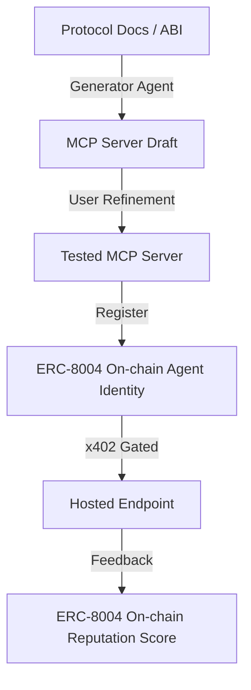
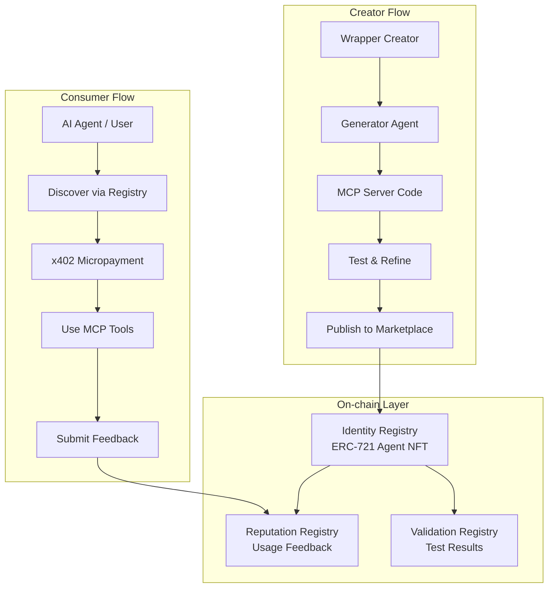

# 🐙 Cryptopus

A permissionless marketplace of vibe-coded community MCP servers for web3 protocols, powered by ERC-8004 trust infrastructure and x402 micropayments.

## Problem

AI agents and assistants lack a trustworthy, standardized interface to interact with the vast landscape of web3 protocols. Most protocols don't provide MCP-compatible interfaces or LLM-friendly documentation, forcing each integration to be built from scratch.

## Solution

Cryptopus lets anyone generate, test, publish, and monetize MCP server wrappers for any blockchain protocol. The best implementations rise to the top through on-chain reputation, and consumers (AI agents and humans) discover and pay for them via standard HTTP.



## Key Features

- **Auto-Generation Pipeline** — Submit protocol docs or ABI, get a working MCP server via AI-assisted generation
- **Competitive Curation** — Multiple wrappers can exist per protocol; reputation determines which gets adopted
- **ERC-8004 Trust Layer** — Each MCP server is a registered on-chain agent with identity, reputation, and validation history
- **x402 Monetization** — Pay-per-call micropayments; wrapper creators earn fees, code stays open-source
- **Community Validation** — Users and agents test with small amounts, vote on correctness via ValidationRegistry

## Architecture Overview



## Tech Stack

- **Smart Contracts**: Solidity (ERC-8004 registries on Ethereum/Base)
- **MCP Server Runtime**: TypeScript / Node.js
- **Generator Agent**: LLM-powered (Claude API) with ABI parsing
- **Payments**: x402 protocol (Coinbase facilitator on Base)
- **Storage**: IPFS for agent registration files and MCP server code
- **Frontend**: React (marketplace UI)

## Quick Start

```bash
# Clone
git clone https://github.com/user/cryptopus
cd cryptopus

# Install
npm install

# Configure
cp .env.example .env
# Set required environment variables

# Generate a wrapper
npm run generate -- --protocol uniswap-v3 --abi ./abis/uniswap-v3.json

# Test locally
npm run test:mcp -- --server ./output/uniswap-v3

# Register on-chain and deploy
npm run publish -- --server ./output/uniswap-v3
```

## License

MIT
