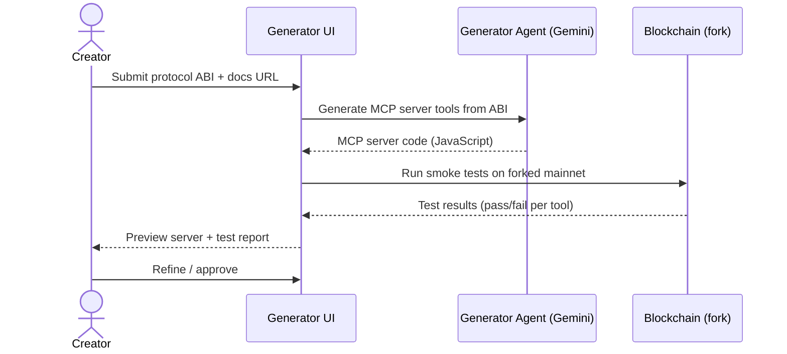
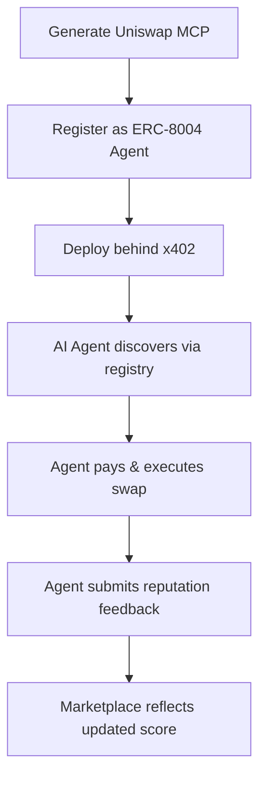
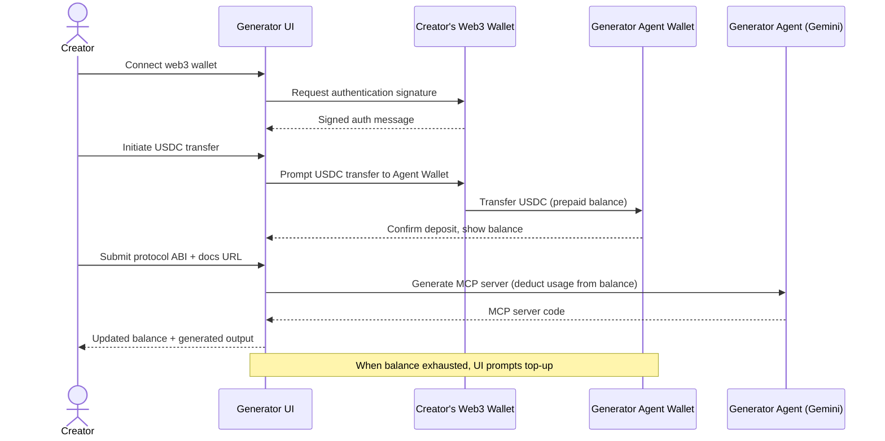

# Cryptopus — Requirements Document

## 1. Project Overview

Cryptopus is a decentralized marketplace where anyone can generate, publish, and monetize MCP (Model Context Protocol) server wrappers for blockchain protocols. Trust and quality are managed through ERC-8004's on-chain registries; monetization uses x402 pay-per-call micropayments.

### 1.1 Personas

| Persona | Description | Goal |
|---------|-------------|------|
| **Wrapper Creator** | Developer or power-user | Generate MCP servers for protocols, earn fees from usage |
| **Wrapper Consumer** | AI agent or human using an AI assistant | Discover and use reliable MCP servers to interact with web3 protocols |
| **Protocol Team** | Core team of a blockchain protocol | Publish an official wrapper or endorse community-built ones |

### 1.2 Scope (Hackathon PoC)

**In scope:**
- AI-assisted MCP server generation from protocol ABI/docs
- On-chain agent registration (ERC-8004 Identity Registry)
- On-chain reputation feedback (ERC-8004 Reputation Registry)
- Community validation via test transactions (ERC-8004 Validation Registry)
- x402 payment-gated hosted endpoints (Coinbase facilitator)
- Marketplace discovery web UI
- 1–2 working protocol wrappers (Uniswap V3, Aave V3)

**Out of scope (stretch goals / future work):**
- Claude API fallback for complex protocol generation
- Sophisticated AI correction chat loop
- Slashing / dispute resolution
- Multi-chain registry deployment
- Production-grade security audits
- Generator Agent usage billing

## 2. Functional Requirements

### 2.1 MCP Server Generation

| ID | Requirement |
|----|-------------|
| F-GEN-1 | System accepts Solidity ABI JSON and optional documentation URL as input |
| F-GEN-2 | Generator produces a valid MCP server with one tool per public write function and relevant read functions |
| F-GEN-3 | Generated tools include parameter descriptions, type validation, and human-readable names |
| F-GEN-4 | Creator can preview and manually edit generated code before publishing |

### 2.2 ERC-8004 Integration

| ID | Requirement |
|----|-------------|
| F-8004-1 | Each published MCP server is registered as an ERC-8004 agent via Identity Registry (`register()` with `agentURI` pointing to IPFS-hosted registration file) |
| F-8004-2 | Registration file includes MCP endpoint in `services` array and `supportedTrust: ["reputation"]` |
| F-8004-3 | After each consumer interaction, the system prompts for feedback submission to Reputation Registry (`giveFeedback()`) |
| F-8004-4 | Feedback uses `tag1` = tool name, `value` = success rating (0–100) |
| F-8004-5 | Before marketplace listing, MCP server must pass validation via Validation Registry (`validationRequest()` / `validationResponse()`) with at least N successful test transactions |
| F-8004-6 | Marketplace displays agent reputation scores aggregated from on-chain feedback |

### 2.3 x402 Monetization

| ID | Requirement |
|----|-------------|
| F-PAY-1 | Hosted MCP endpoints are gated with x402 middleware; unauthenticated requests receive HTTP 402 with payment instructions |
| F-PAY-2 | Payment is per-tool-call in USDC on Base |
| F-PAY-3 | Revenue split: wrapper creator receives majority, platform receives remainder |
| F-PAY-4 | MCP server source code is open-source (MIT) on IPFS/GitHub; payment gate applies only to hosted instances |
| F-PAY-5 | Feedback submitted with `proofOfPayment` (txHash) in off-chain feedback file receives higher trust weight in the UI |

### 2.4 Marketplace & Discovery

| ID | Requirement |
|----|-------------|
| F-MKT-1 | Marketplace lists all registered MCP server agents, filterable by protocol |
| F-MKT-2 | Each listing shows: agent name, protocol, reputation score, validation status, price per call, endpoint |
| F-MKT-3 | Multiple wrappers per protocol are supported; sorted by reputation score |
| F-MKT-4 | Consumer can test any wrapper with a small-amount test transaction before committing |

## 3. Non-Functional Requirements

| ID | Requirement |
|----|-------------|
| NF-1 | MCP servers conform to MCP specification (tools, resources, prompts) |
| NF-2 | On-chain transactions target Ethereum mainnet or Base for ERC-8004 registries |
| NF-3 | x402 payments settle on Base via Coinbase facilitator |
| NF-4 | Agent registration files hosted on IPFS for censorship resistance |
| NF-5 | Generator agent uses Gemini API (gemini-2.5-flash) via `@google/genai` SDK |
| NF-6 | Hackathon PoC tolerates instability; production hardening is deferred |

## 4. Acceptance Criteria (Hackathon Demo)

1. **Generation**: Given a Uniswap V3 ABI, the system produces a working MCP server with swap/quote tools
2. **Registration**: The MCP server is registered on-chain with a valid ERC-8004 identity and IPFS-hosted registration file
3. **Payment**: An AI agent calling the MCP endpoint receives HTTP 402, pays via x402, and gets the response
4. **Reputation**: After usage, feedback is recorded on-chain and visible in the marketplace UI
5. **Validation**: At least one test transaction is recorded via ValidationRegistry before the agent appears as "validated" in the marketplace

## 5 Out of PoC Scope

### 5.1 Generator Agent Usage Billing

