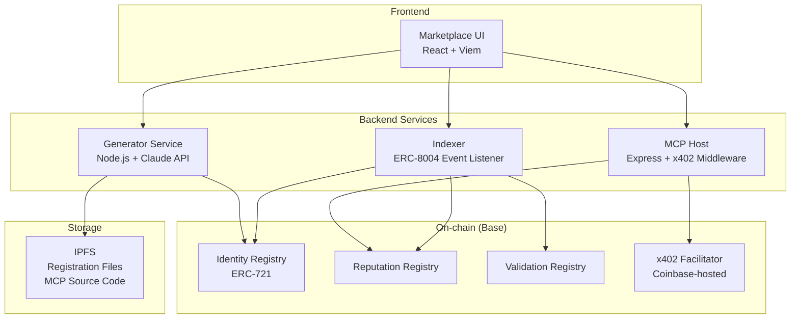
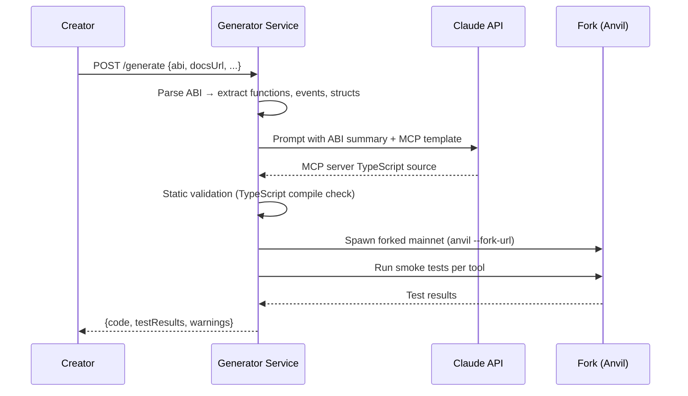
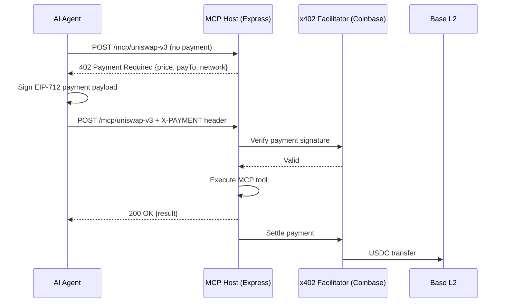
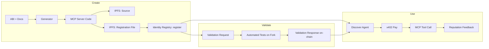

# CryptoPotus — Technical Specification

## 1. System Architecture



## 2. Component Specifications

### 2.1 Generator Service

Transforms protocol ABIs into MCP-compliant TypeScript servers.

**Input:**
```json
{
  "protocolName": "uniswap-v3",
  "abi": [ /* Solidity ABI JSON array */ ],
  "docsUrl": "https://docs.uniswap.org/",
  "chainId": 1,
  "contractAddresses": {
    "SwapRouter": "0xE592427A0AEce92De3Edee1F18E0157C05861564"
  }
}
```

**Pipeline:**



**LLM Prompt Strategy:**

The generator sends the Claude API a structured prompt containing:
1. The parsed ABI with function signatures and NatSpec comments
2. A base MCP server template (TypeScript)
3. Protocol-specific context fetched from `docsUrl`
4. Instructions to generate one MCP tool per meaningful contract function

The output is a single TypeScript file that exports a valid MCP server. The prompt instructs the model to include parameter validation, human-readable tool descriptions, and sensible defaults (e.g., slippage tolerance for swaps).

**Smoke Testing:**

Each generated tool is tested against a forked mainnet (Anvil) with:
- Funded test wallet (1 ETH + relevant tokens)
- Static call first (revert check), then simulated send
- Pass/fail + revert reason captured per tool

### 2.2 MCP Server Structure

Each generated server follows this layout:

```
output/uniswap-v3/
├── server.ts          # MCP server entry point
├── tools/
│   ├── swap.ts        # exactInputSingle wrapper
│   ├── quote.ts       # quoteExactInputSingle wrapper
│   └── positions.ts   # LP position queries
├── abi.json           # Source ABI
├── config.ts          # Contract addresses, chain config
└── agent.json         # ERC-8004 capability manifest
```

**MCP Tool Definition Example:**

```typescript
{
  name: "uniswap_v3_swap_exact_input",
  description: "Swap an exact amount of input token for output token via Uniswap V3",
  inputSchema: {
    type: "object",
    properties: {
      tokenIn:  { type: "string", description: "Input token address" },
      tokenOut: { type: "string", description: "Output token address" },
      amountIn: { type: "string", description: "Amount in (wei)" },
      slippage: { type: "number", description: "Slippage tolerance %", default: 0.5 }
    },
    required: ["tokenIn", "tokenOut", "amountIn"]
  }
}
```

### 2.3 ERC-8004 Integration

Uses the existing mainnet deployment. Three registry interactions:

#### Identity Registry

On publish, call `register(agentURI)` where `agentURI` points to IPFS-hosted registration file.

**Registration File:**

```json
{
  "type": "https://eips.ethereum.org/EIPS/eip-8004#registration-v1",
  "name": "CryptoPotus :: Uniswap V3",
  "description": "Community-generated MCP server for Uniswap V3. Tools: swap, quote, positions.",
  "image": "ipfs://{cid}/icon.png",
  "services": [
    {
      "name": "MCP",
      "endpoint": "https://mcp.cryptopotus.xyz/uniswap-v3",
      "version": "2025-06-18"
    },
    {
      "name": "web",
      "endpoint": "https://cryptopotus.xyz/agents/42"
    }
  ],
  "x402Support": true,
  "active": true,
  "registrations": [
    {
      "agentId": 42,
      "agentRegistry": "eip155:8453:0x..."
    }
  ],
  "supportedTrust": ["reputation"]
}
```

#### Reputation Registry

After each consumer interaction:

```solidity
// Consumer (or consumer's agent) calls:
reputationRegistry.giveFeedback(
    agentId,       // MCP server's ERC-8004 ID
    85,            // value: 0-100 quality score
    0,             // valueDecimals
    "swap",        // tag1: tool name
    "",            // tag2: unused
    "https://mcp.cryptopotus.xyz/uniswap-v3",  // endpoint
    "ipfs://...",  // feedbackURI (includes proofOfPayment)
    bytes32(0)     // hash (IPFS is content-addressed)
);
```

**Off-chain feedback file** (at `feedbackURI`):

```json
{
  "agentRegistry": "eip155:8453:0x...",
  "agentId": 42,
  "clientAddress": "eip155:8453:0xConsumer...",
  "createdAt": "2026-03-10T14:00:00Z",
  "value": 85,
  "valueDecimals": 0,
  "tag1": "swap",
  "mcp": { "tool": "uniswap_v3_swap_exact_input" },
  "proofOfPayment": {
    "fromAddress": "0xConsumer...",
    "toAddress": "0xPlatform...",
    "chainId": "8453",
    "txHash": "0xabc..."
  }
}
```

#### Validation Registry

Before marketplace listing, a validator (platform-operated for PoC) runs automated test suites:

```mermaid
sequenceDiagram
    participant MCP as MCP Server Agent
    participant VR as Validation Registry
    participant V as Validator (Platform)
    participant Fork as Anvil Fork

    MCP->>VR: validationRequest(validatorAddr, agentId, requestURI, requestHash)
    VR-->>V: Event: ValidationRequest
    V->>Fork: Execute all MCP tools with test parameters
    Fork-->>V: Results (pass/fail per tool)
    V->>VR: validationResponse(requestHash, score, responseURI, ...)
    Note over VR: score 0-100; ≥70 = "validated"
```

### 2.4 x402 Payment Layer

Each hosted MCP endpoint runs Express with x402 middleware.

```typescript
import { paymentMiddleware } from "@x402/express";

app.use(paymentMiddleware({
  "POST /mcp/uniswap-v3": {
    price: "$0.005",
    network: "base",
    accepts: [{ scheme: "exact", network: "base", asset: "USDC" }],
    description: "Uniswap V3 MCP tool call"
  }
}));
```

**Payment flow:**



**Revenue split** (handled at application level, not on-chain for PoC):
- 80% → wrapper creator wallet
- 20% → platform wallet

### 2.5 Indexer

Listens for ERC-8004 registry events and builds a queryable index for the marketplace UI.

**Tracked events:**
- `Registered(agentId, agentURI, owner)` — new MCP server listed
- `NewFeedback(agentId, clientAddress, ...)` — reputation update
- `ValidationResponse(validatorAddress, agentId, ...)` — validation result
- `URIUpdated(agentId, newURI, ...)` — registration file changed

**Implementation:** Simple Node.js process using `viem` `watchContractEvent`. Stores indexed data in SQLite for PoC. Exposes REST API consumed by the marketplace frontend.

### 2.6 Marketplace Frontend

React SPA with:
- **Browse page**: list of registered MCP server agents, filterable by protocol, sortable by reputation
- **Agent detail page**: reputation history, validation status, tool list, endpoint URL, price, source code link
- **Generator page**: form to submit ABI + docs, preview generated server, publish
- **Wallet connection**: via wagmi/viem for on-chain interactions (register, feedback)

## 3. Data Flow Summary



## 4. Deployment Topology (Hackathon)

| Component | Where | Notes |
|-----------|-------|-------|
| ERC-8004 Registries | Base mainnet (or Sepolia) | Use existing deployed singletons |
| x402 Facilitator | Coinbase-hosted | Free tier: 1000 tx/month |
| MCP Host + x402 | Single VPS or local | Express server |
| Generator Service | Same VPS or local | Needs Claude API key |
| Indexer | Same VPS or local | SQLite backend |
| Frontend | Vercel or local | Static React app |
| IPFS | Pinata / web3.storage | Registration files + source code |
| Anvil (testing) | Local / ephemeral | Forked mainnet for smoke tests |

## 5. Dependencies

| Dependency | Purpose | Version |
|------------|---------|---------|
| `@modelcontextprotocol/sdk` | MCP server implementation | latest |
| `viem` | Ethereum interactions + contract calls | ^2.x |
| `@x402/express`, `@x402/core` | x402 payment middleware | latest |
| `@anthropic-ai/sdk` | Claude API for code generation | latest |
| `express` | HTTP server for MCP hosting | ^4.x |
| `better-sqlite3` | Indexer storage | latest |
| `wagmi` | Frontend wallet connection | ^2.x |
| `foundry/anvil` | Forked mainnet testing | latest |

## 6. Known Risks & Mitigations

| Risk | Impact | Mitigation |
|------|--------|------------|
| LLM generates incorrect contract interactions | Fund loss in production (acceptable in PoC with test amounts) | Smoke tests on forked mainnet; ValidationRegistry gating; low-amount test-first UX |
| ERC-8004 registry gas costs on mainnet | High cost per registration | Deploy on Base (low gas) or use Sepolia for demo |
| x402 facilitator downtime | Payments fail | Fallback: demo without payment gate; re-enable when facilitator is up |
| MCP spec changes | Server incompatibility | Pin MCP SDK version |
| Sybil reputation attacks | Fake high scores | PoC: accept risk; future: weight feedback by payment proof + trusted reviewer sets |
